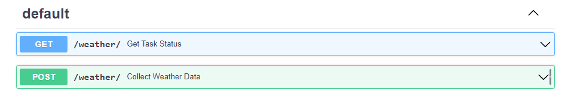
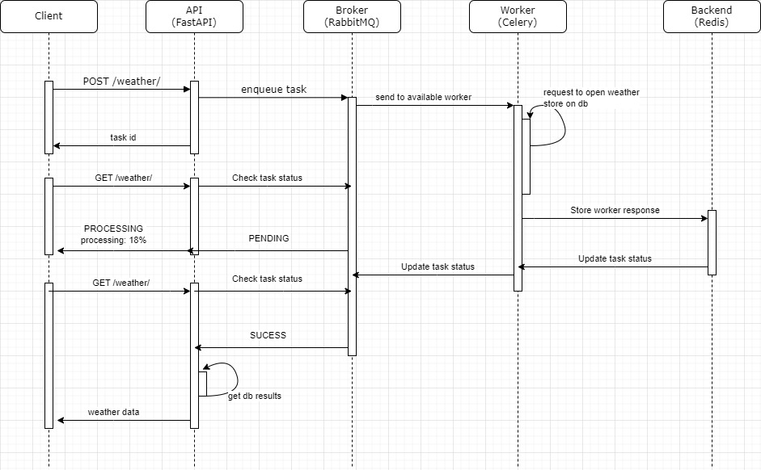
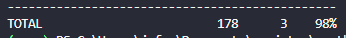
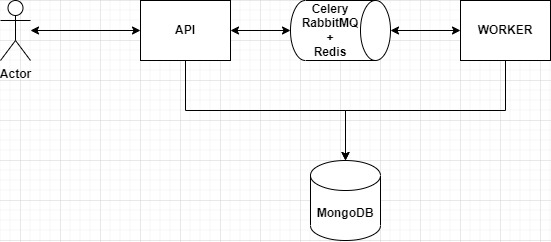
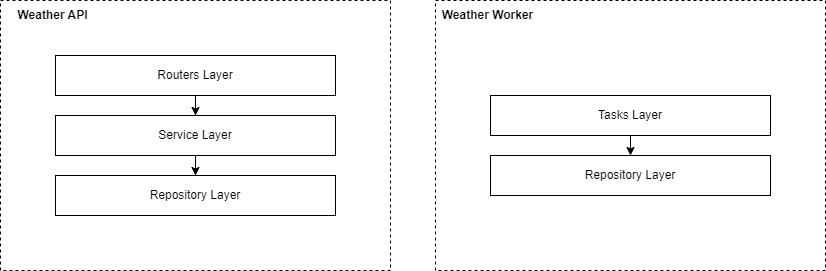
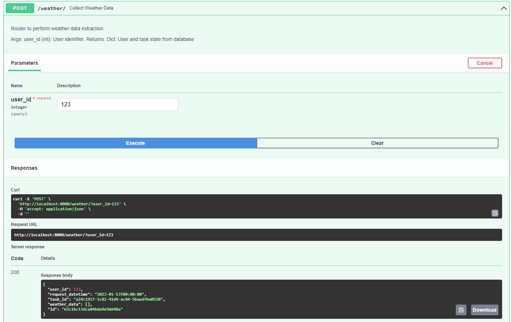
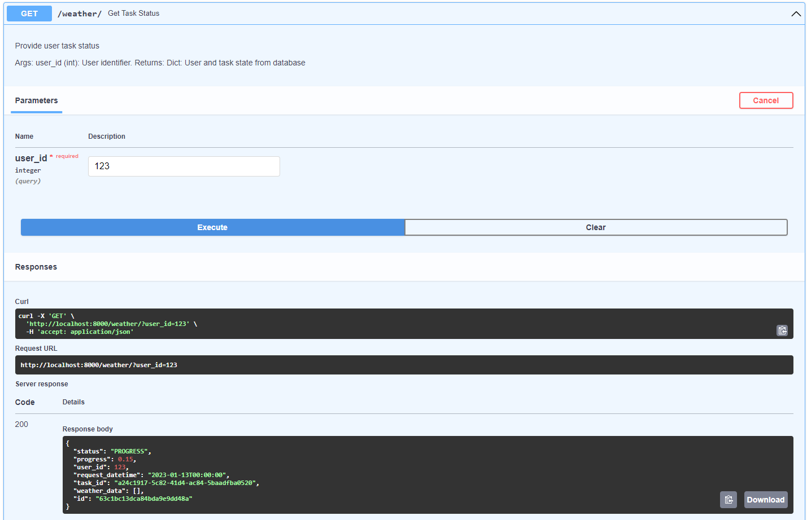
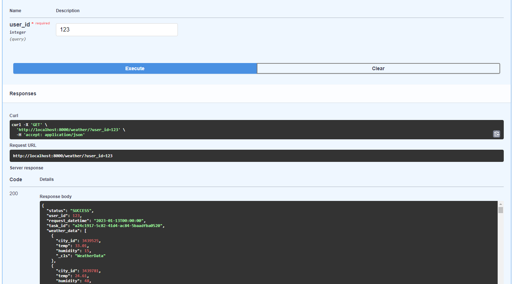

# Weather API

## Running

It is highly recommended to use the [Docker](https://www.docker.com/) environment for both running and testing this repository. Using docker as a way to execute scripts allows for greater replicability during testing, as it provides isolation from the operating system on which the developer is running the software, containers also package the application and its dependencies together, making it easy to move the application between different environments. This allows for consistent behavior across development, testing, and production environments.

First of all, build the project using:

`docker-compose build`

Then you can run typing:

`docker-compose up`

After all project is up, it should spent between 3 to 15 seconds, you can check the project documentation by accessing, in your browser, this [link](http://localhost:8000/docs) or enter: `http://localhost:8000/docs`. 

  
  
API endpoints

As a client, you can use of the API in the following sequence:

1. To start a data extraction and get weather data for each available city, you must provide a user identifier that must be unique.

2. When using the user identifier to check the status of a call, it will be possible to observe the progress of the activity in a range from 0 to 1, where 1 means 100% and all data has already been collected.

3. When all extraction is finished, you can see the requested data in the json response.

  
  
API sequende diagram

## Testing
To perform the required tests for this tool, it was decided to run them inside containers. Running tests inside containers offers great advantages in terms of replicability, isolation, consistent environment, and promotes a gain when the system is applied to an CI pipeline. 

Due to the isolation, all tests should be performed with mocks, without any contact with the external environment. This is why a good choice of software architecture is necessary to be able to cover the code without the need for external systems.

The tool chosen for unit testing was [pytest](https://docs.pytest.org/) and for test coverage we used [coverage.py](https://coverage.readthedocs.io/).

Before proceed with tests, build all necessary images:

`docker-compose -f docker-tests.yml build`

Then you can check unit test coverage using:

`docker-compose -f docker-tests.yml run unit-tests`

You should able to see this response:

  
  
Coverage report

## System Arcihtecture Overview

## FastAPI

[FastAPI](https://fastapi.tiangolo.com/) is an open-source, modern, fast (high-performance), web framework for building APIs with Python 3.6+ based on standard Python type hints. It is built on top of Starlette for the web parts and Pydantic for the data parts. 

One of the key features of FastAPI is its use of type hints for parameter validation and serialization, which allows for the automatic generation of an Swagger schema for the API, making it easy to document and test. FastAPI also has built-in support for dependency injection, which makes it easy to organize the codebase and make it more maintainable, and it also has support for asynchronous programming using the async/await syntax.

### MongoDB

Non-relational databases are used to store data that is not consistent in structure. One of the requirements of the system was to store data in json format, which can contain different fields, different amounts of data and also different nesting. For this reason the data will be stored in [MongoDB](https://www.mongodb.com). It is an open-source, document-oriented database designed for ease of development and scaling. Instead of storing data in tables as rows and columns, MongoDB stores JSON-like documents with dynamic schemas, making the integration of data in certain types of applications easier and faster. It is often used for big data and real-time web applications.

### Celery

Due to the large amount of time required to request all the weather data using REST methods from the API, and also due to the high probability of failures happening during this whole process, it was decided to use an asynchronous task management system called [Celery](https://docs.celeryq.dev/en/stable/).

Celery uses a message broker, such as RabbitMQ or Redis, to pass messages between the application and the worker processes that execute the tasks. This allows for the tasks to be distributed across multiple worker machines or processes, allowing for greater scalability and fault tolerance.

Celery also provides a variety of features for task management, such as retries, task prioritization, and task scheduling. This makes it a powerful tool for building robust and scalable systems that need to perform background tasks.

  
  
System Arcihtecture Overview

## API Architecure

This software was developed using a Layered Archtecure that is a design pattern in which an application or system is composed of several layers, each of which has a specific role and responsibility. These layers are organized in a hierarchical structure, with each layer providing services to the layers above it and being dependent on the layers below it. This approach can help to improve the maintainability, scalability, and reusability of the software. 

A layered software architecture can provide several benefits for testing, including:

1. Isolation: Each layer can be tested independently, which allows for more targeted and efficient testing. This can also make it easier to identify and isolate bugs.

2. Modularity: Layers can be replaced or updated independently, which can make it easier to add new features or update existing ones without disrupting the entire system.

3. Reusability: Layers can be reused across different parts of the system, which can reduce the amount of redundant code and make it easier to maintain consistency across the system.

4. Mocking: It's easy to mock the dependencies of a layer when testing it, this will make the test more reliable and fast.

5. Abstraction: Layers provide abstraction, which can make it easier to understand how different parts of the system interact and how changes in one part of the system will affect the rest.

This software provides:

- **Routers Layer**: also called presentation layer, are used to handle routing requests in  this web application, sits between the user interface and the back-end services. This layer is responsible for interpreting URLs and determining which actions or controllers should handle the request.

- **Services Layer**: encapsulate the business logic and functionality of this system.  It sits between the routers layer, which handles the endpoint interfaces, and the repository layer, which handles data persistence.

- **Repository Layer**: is an abstraction layer that sits between the service layer and the data layer. It is responsible for providing a consistent interface for accessing and manipulating data, regardless of the underlying data storage technology. The Repository pattern is often used to separate the data access logic from the business logic, which allows the system to be more flexible and easier to maintain.

  
  
API Architecure

## Relevant Implemented Features

- **OpenWeather Request Fault Tolerance**: if any of the requests to OpenWeather fail, the system will identify what happened and restore the extraction automatically, without any external action. This occurs following the [Exponential backoff](https://en.wikipedia.org/wiki/Exponential_backoff) strategy. The first retry will have a delay of 1 second, the second retry will have a delay of 2 seconds, the third will delay 4 seconds, the fourth will delay 8 seconds, and so on. 

- **User MultiPosting**: Same users can perform more than one extraction operation.

## Relevant Screenshots

  
  
Posting to API and get the json response

  
  
Checking job status. In the picture we can see status is PROGRESS and the progress is 15%

  
  
Stored information in database. Relevant fields: The user defined ID, Datetime of request and Weather Data

  
  
Once finished, status turn to SUCESS and the data can be seen in the response json

